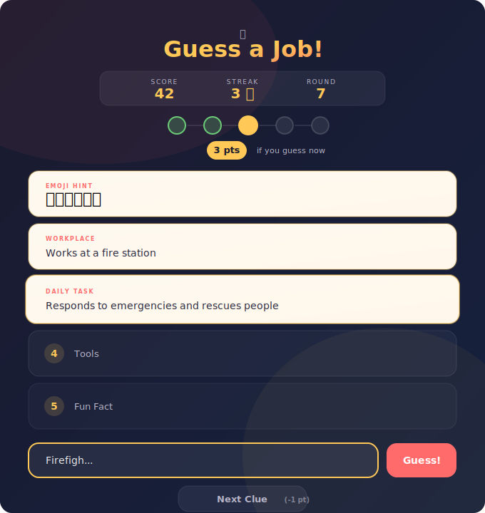

# guess-a-job

A fun, casual web game where you guess occupations from progressive clues. Built for leisure and passing time.

**[Play Now](https://alfredang.github.io/guess-a-job/)**

## How to Play

1. Each round, a mystery job is chosen from a pool of 58 occupations
2. You get **5 clues** revealed one at a time: emoji hint, workplace, daily task, tools, and a fun fact
3. Guess early for more points — **5 pts** on clue 1, down to **1 pt** on clue 5
4. Build a streak for bonus points

## Features

- 58 unique jobs with 5 handcrafted clues each
- Autocomplete input with keyboard navigation
- Fuzzy matching (accepts synonyms like "cop" for Police Officer)
- Streak bonuses for consecutive correct guesses
- Card flip animations and confetti celebrations
- Mobile responsive design
- No frameworks or build tools — pure HTML, CSS, and JavaScript

## Getting Started

Open `index.html` in your browser. That's it.

## Tech Stack

- HTML5
- CSS3 (animations, backdrop-filter, CSS variables)
- Vanilla JavaScript (Canvas API for confetti)
